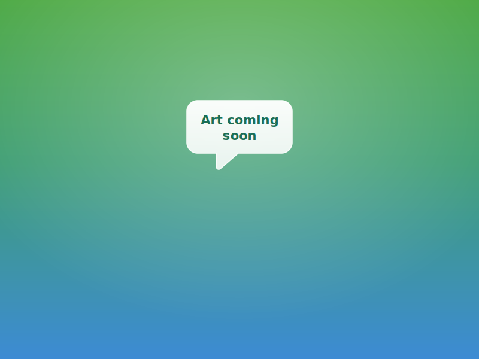

# Cyber scenario placeholder art

## File

`assets/cyber/placeholder.svg`

## Purpose

Temporary branded artwork for all cyber bullying scenario panels until final illustrations are produced. Used for scene backgrounds and correct/incorrect result panels in `online_bully/scenario1.html` through `scenario3.html`.

## Design

- Outdoor "scene" gradient running top→bottom: leaf green (`#4faa46`) → teal (`#3f9e74`) → sky blue (`#3d8bd4`)
- SVG uses `preserveAspectRatio="xMidYMid slice"` and is rendered with `object-fit: cover` so it fills the entire stage/viewport (the centred bubble stays in a safe zone and is never cropped out)
- Compact centred white speech bubble with green-navy (`#1b6e54`) **Art coming soon** label
- No yellow accent dots or phone frame — kept minimal for small viewports
- The `.game-stage` background and scrim in `css/style.css` are tuned to match the artwork

## Result-panel alignment

The shared result panels (`#right-answer`, `#wrong-answer`) are pinned to the bottom
so the feedback banner / prompt / Next button sit **below** the artwork subject
(the cyber bubble, and the character faces in the physical scenarios) instead of being
centered on top of it:

```css
#right-answer,
#wrong-answer {
    justify-content: flex-end;
}
```

This matches the scene panels (`.game-stage { justify-content: flex-end }`) and applies
to correct + incorrect across **all** scenarios, cyber and physical.

## Page wiring

All nine stage images across `online_bully/scenario1.html`–`scenario3.html` (scene + correct + incorrect panels) use:

```html

```

CSS in `css/style.css` applies `object-fit: contain`, a matching stage background, and a lighter scrim via `.stage-img--placeholder` so the small bubble stays visible on narrow screens.

## Replacing with final art

When real cyber scenario images are ready, add them under `assets/cyber/` and update each scenario page:

| Panel | Suggested filename pattern |
| --- | --- |
| Scene | `witnessCyberbullying.jpg`, `youAreCyberbullied.jpg`, `friendCyberbullied.jpg` |
| Happy result | `*HAPPY.jpg` |
| Sad result | `*SAD.jpg` or `*REGRET.jpg` |

Mirror the path conventions used in `assets/physical/` (relative `../assets/cyber/...` for scene images, root-absolute `/assets/cyber/...` for result panels if following the physical track pattern).
